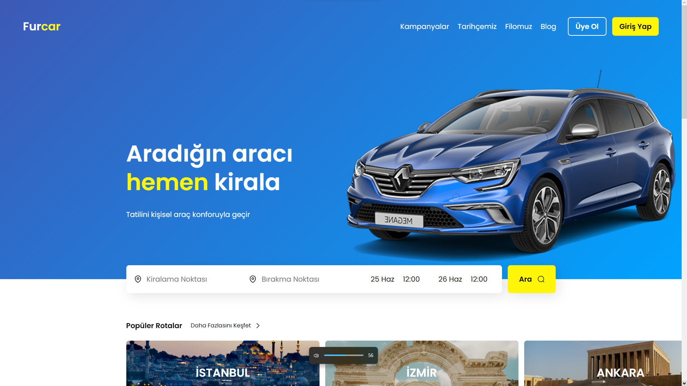

# Furcar - Rent a Car Website Demo

Hello everyone, this project is a demo that I designed and developed from scratch.

## Table of contents

- [Overview](#overview)
  - [The goal](#the-challenge)
  - [Screenshot](#screenshot)
  - [Links](#links)
- [My process](#my-process)
  - [Built with](#built-with)
  - [What I learned](#what-i-learned)
  - [Continued development](#continued-development)
- [Author](#author)

## Overview

### The goal

My goal in this project was to create a web design that is responsive and good-looking and then develop it.

### Screenshot

### Links

- Live Site URL: [See Live](https://doganfurkan.github.io/Furcar/)

## My process

### Built with

- Semantic HTML5 markup
- CSS custom properties
- Flexbox
- Mobile-first workflow
- Figma

### What I learned

In this project, I used the Figma plugin for VS Code for the first time and got a chance to see how faster it allows me to work. It really is a great tool.

### Continued development

In this project, I need specialized date and time inputs that don't have accessibility issues. I haven't developed them yet but I want to dive deep into this topic and come up with one.

## Author

- LinkedIn - [Furkan Doğan](https://www.linkedin.com/in/furkan-doğan)
- Frontend Mentor - [@doganfurkan](https://www.frontendmentor.io/profile/doganfurkan)
- Instagram - [@1furkandogan1](https://www.instagram.com/1furkandogan1)

